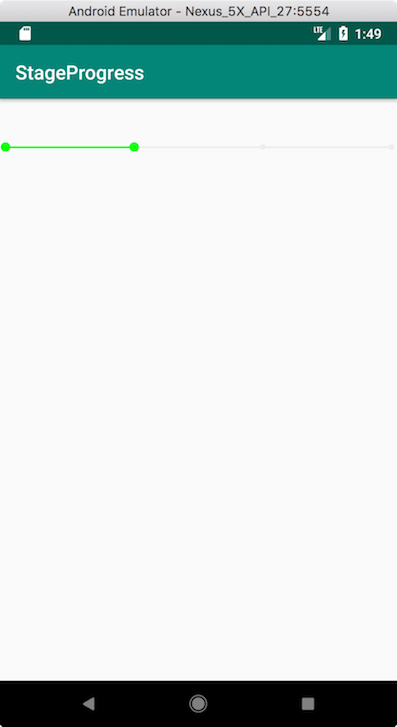

# StageProgress
阶段进度条

简单的自定义View,实现通过手动点击选中节点，并高亮连接前面的节点。

| 自定义属性 | 用途 |
| -------- | ---------- |
| normal_color | 未被选中节点以及连线的颜色 |
| selected_color | 已选中节点以及连线颜色 |
| normal_node_radius | 未被选中节点半径 |
| selected_node_radius | 已选中节点半径 |
| node_num | 节点总个数 |
| current_node_index | 目前选中节点位置 |

